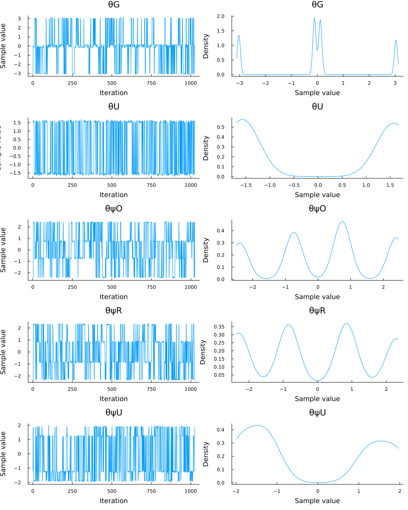
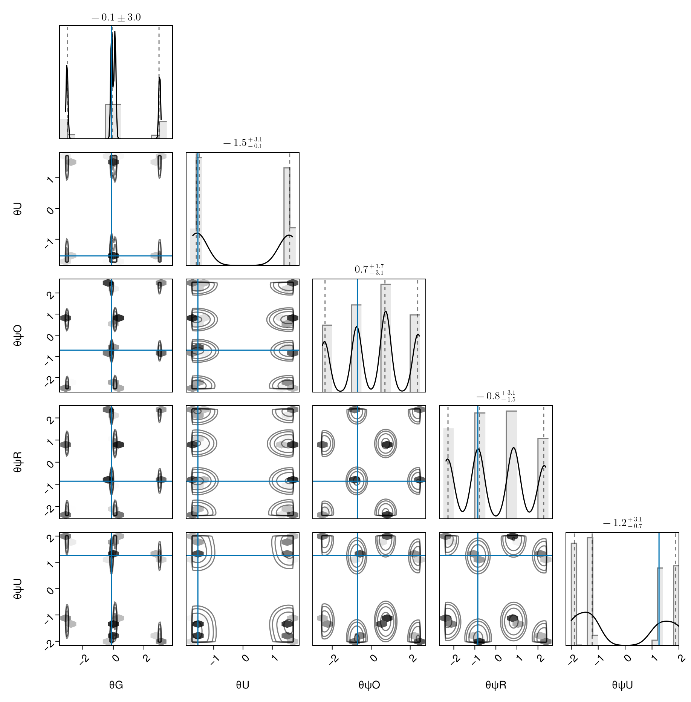
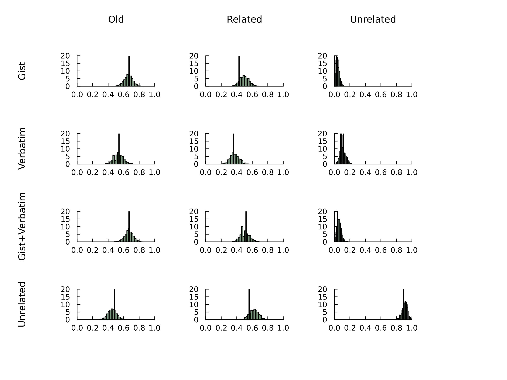

```@raw html

```

# Bayesian Parameter Estimation

In this tutorial, we demonstrate how to perform Bayesian parameter estimation of the GQEM using [Pigeons.jl](https://github.com/Julia-Tempering/Pigeons.jl) with the [Turing.jl](https://turinglang.org/) interface. 
For a description of the decision making task, please see the description in the [model overview](https://itsdfish.github.io/TrueAndErrorModels.jl/dev/overview/). 

## Load Packages

The first step is to load the required packages. You will need to install each package in your local
environment in order to run the code locally. We will also set a random number generator so that the results are reproducible.

```julia
using Pigeons
using QuantumEpisodicMemory
using Random
using Turing
using StatsPlots
Random.seed!(3320)
```

## Generate Data

In the code block below, we generate simulated data for parameter estimation. The first portion of the code block generates a `NamedTuple` of the parameters. Next, the parameters are passed to the `GQEM` model constructor. Finally, we generate responses from 100 trials per condition and combine the data inputs into a `Tuple` named data. 

```julia
parms = (
    θG = -.12,
    θU = -1.54,
    θψO = -.71,
    θψR = -.86,
    θψU = 1.26,
)
dist = GQEM(; parms...)
n_trials = 100
responses = rand(dist, n_trials)
data = (n_trials, responses)
```

To make the responses easier to interpret, we can use `to_table` to add labels to the rows and columns. The rows correspond to experimental conditions and columns correspond to word types.

```julia 
table = to_table(responses)
```

```julia
4×3 Named Matrix{Int64}
condition ╲ word type │       old    related  unrelated
──────────────────────┼────────────────────────────────
gist                  │        70         63          6
verbatim              │        49         48         10
gist+verbatim         │        64         49          5
unrelated new         │        46         63         91
```

## Turing Model

In the code block below, the Bayesian model is defined using the `@model` macro in Turing. The parameters inside the model function follow a Von Mises distribution, which roughly corresponds to a normal distribution on a circle (i.e., the support is $[-\pi, \pi]$). For each parameter the mean is set to zero, and the concentration parameter, which is inversely related to the variance, is set to a small number of $.10$.

```julia
@model function model(data)
    θG ~ VonMises(0, .1)
    θU ~ VonMises(0, .1)
    θψO ~ VonMises(0, .1)
    θψR ~ VonMises(0, .1)
    θψU ~ VonMises(0, .1)
    data ~ GQEM(; θG, θU, θψO, θψR, θψU)
end
```

## Estimate the Parameters

Quantum models present challenges for many MCMC samplers because they often produce multimodal posterior distributions. 
Multimodal distributions can be traced back to the periodic effect of rotating state vectors or bases. As illustrated below, the
marginal log likelihood of the data vacillates as $\theta_U$ varies across its permissible range. 


```@raw html
<details>
<summary><b>Show Code </b></summary>
```
```julia 
θUs = range(-π, π, length = 300)
LLs = map(θU -> logpdf(GQEM(; parms..., θU), n_trials, responses), θUs)
plot(θUs, LLs, xlabel = "θU", ylabel = "LL", leg=false, grid=false)
```
```@raw html
</details>
```
To overcome limitations of common MCMC samplers, we will use parallel tempering with the package `Pigeons.jl`.  In the code block below,
we pass the Turing model with the tuple of data to the function `pigeons`. Because the GQEM is highly multimodal, we increase the number of chains 
from the default of 10 to 20. 

```julia
# Estimate parameters
pt = pigeons(
    target = TuringLogPotential(model(data)), 
    record = [traces], 
    multithreaded = true, 
    n_chains = 20,
)
```
```julia
chains = Chains(pt)
```
The output below shows the mean, standard deviation, effective sample size, and rhat for each of the five parameters. The panel below shows the quantiles of the marginal distributions. 
```julia
Summary Statistics
  parameters      mean       std      mcse   ess_bulk   ess_tail      rhat   ess_per_sec 
      Symbol   Float64   Float64   Float64    Float64    Float64   Float64       Missing 

          θG   -0.0883    1.9003    0.1310   209.2796   495.0300    1.0026       missing
          θU   -0.0527    1.5713    0.0858   404.8390   543.2327    0.9994       missing
         θψO    0.1158    1.6601    0.1256   188.7431   617.9621    1.0053       missing
         θψR   -0.0568    1.6559    0.1124   230.9679   527.2334    1.0123       missing
         θψU   -0.2296    1.5712    0.1082   171.3612   587.1192    1.0227       missing

Quantiles
  parameters      2.5%     25.0%     50.0%     75.0%     97.5% 
      Symbol   Float64   Float64   Float64   Float64   Float64 

          θG   -3.0715   -0.1495   -0.0539    0.1420    3.0691
          θU   -1.6493   -1.5724   -1.4849    1.5704    1.6413
         θψO   -2.4354   -0.7697    0.7051    0.7974    2.4393
         θψR   -2.3437   -0.8994   -0.7815    0.8831    2.3380
         θψU   -1.9365   -1.8452   -1.2235    1.2722    1.9279
```

## Posterior Distributions

### Mariginal Posterior Distributions 

The marginal posterior distributions below are highly multimodal, as expected.

```julia
plot(chains, grid = false)
```


### Corner Plots 

Below, we will use corner plots to assess the ability of `Pigeons` to recover the data generating parameters. The corner plots are arranged as a matrix such that the subplot in row i and column j is the join posterior distribution of parameter i and parameter j. The blue horizontal and vertical lines represent the true, data-generating parameter values. For each parameter pair, the blue lines intersect on one of the modes, indicating the parameters were correctly recovered. 

```julia
pairplot(chains, PairPlots.Truth(parms))
```



### Posterior Predictive Distributions 

Finally, we will evaluate the descriptive adequacy of the GQEM by comparing the posterior predictive distributions to the generated data. The first step is to create a new Turing model to generate predictions from the posterior distribution. In the code block below, we asign the Turing model to the keyword `model`, we assign a function to that normalizes the predictions to keyword `func`, and set the number of samples to the number of trials per condition.

```julia
pred_model =
    predict_distribution(GQEM; model = model(data), func = x -> x ./ n_trials, n_samples = n_trials)
```
The next step is to sample from the posterior predictive distribution. The output is a matrix of matrices, where each submatrix is a prediction for each condition. 

```julia 
post_preds = generated_quantities(pred_model, chains)
```
In the code block below, we plot the posterior predictive distribution for each condition and plot the generated data as a black, vertical line. In all cases, the distributions are centered near the data, indicating the model can reproduce the pattern observed in the data.
```julia
plot_predictions(post_preds, responses, n_trials)
```



# References

Trueblood, J. S., & Hemmer, P. (2017). The generalized quantum episodic memory model.
Cognitive Science, 41(8), 2089-2125.